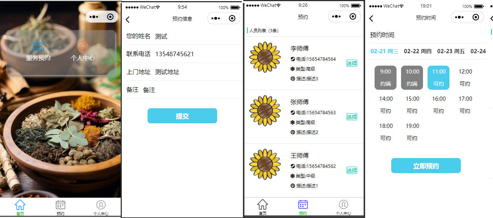
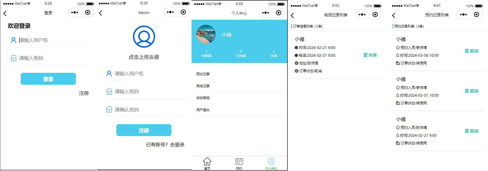
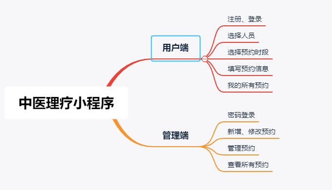

# 中医理疗上门预约小程序

> 一个简单的理疗推拿预约系统。包括 小程序、服务端。

**相关项目**

| 项目   | 备注   |
| ------ | ------ |
| wxapp  | 小程序 |
| server | 服务端 |

### 主要技术

* `原生小程序 +Spring boot + JPA` ： 实现基于 `RESTful` 的前后端分离架构。
* `Lombok` ： 减少了冗余的 Getter / Setter 代码。

### 软件界面

#### 小程序

#### 程序功能

